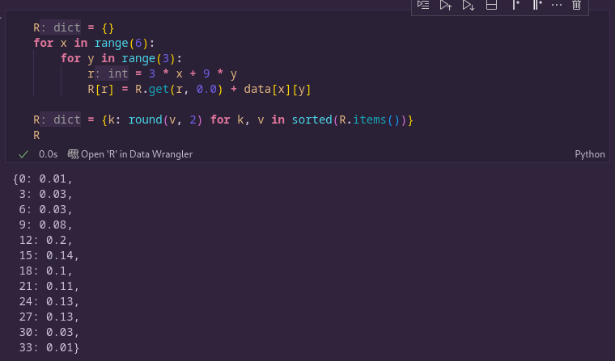
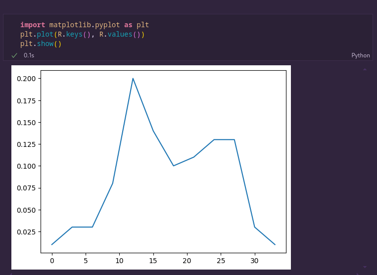
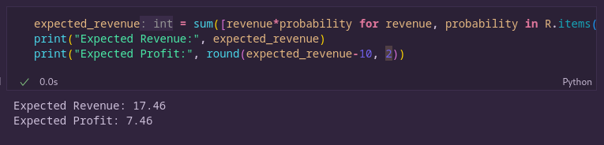
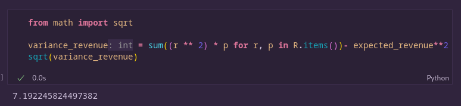

### 1.

##### (a) \( P(X \geq 2) \)

\[
P(X \geq 2) = 1 - P(X = 1) = 1 - \frac{1}{13} = \frac{12}{13}.
\]

##### (b) \( P(X \leq 10) \)

\[
P(X \leq 10) = 1 - P(X = 11) = \frac{10}{13}.
\]

##### (c) \( P(X \leq Y) \)

- \( X \leq Y \) is false for red cards, true for black.
- \( P(X \leq Y) = 26/52 = 1/2 \).

##### (d) Distribution of \( Y - X \)

\[
P(Y - X = -1) = \frac{1}{2}, \quad P(Y - X = 1) = \frac{1}{2}.
\]

##### (e) \( P(Y \leq 12) \)

- \( Y \leq 12 \) always holds (no cases where \( Y > 12 \)).
  \[
  P(Y \leq 12) = 1.
  \]

---

### 2.

##### (a) Probability Distribution of \( X \)

Using probability rules:

\[
P(X = 1) = P(H) = \frac{1}{2}
\]

\[
P(X = 2) = P(T) \cdot P(\text{die shows 2 or 3}) = \frac{1}{2} \times \frac{2}{6} = \frac{1}{6}
\]

\[
P(X = 3) = P(T) \cdot P(\text{die shows 1, 4, 5, or 6}) = \frac{1}{2} \times \frac{4}{6} = \frac{2}{6} = \frac{1}{3}
\]

Thus, the probability distribution is:

| \( X \)    | 1                 | 2                 | 3                 |
| ---------- | ----------------- | ----------------- | ----------------- |
| \( P(X) \) | \( \frac{1}{2} \) | \( \frac{1}{6} \) | \( \frac{1}{3} \) |

##### (b) Cumulative Distribution Function (CDF)

The cumulative distribution function \( F(x) = P(X \leq x) \):

\[
F(x) =
\begin{cases}
0, & x < 1 \\
\frac{1}{2}, & 1 \leq x < 2 \\
\frac{2}{3}, & 2 \leq x < 3 \\
1, & x \geq 3
\end{cases}
\]

This defines the probability accumulation for each \( x \).

---

### 3.

(a) The revenue for the ferry is R = 3X + 9Y . Find the possible values of R and the associated
probabilities.

(b) Compute the expected revenue E(R) and the expected profit for the ferry owner. What is the standard deviation of the profit?

---

### 4.

Sure! Let's break this down step-by-step and solve it using the **Hypergeometric distribution**.

### **Hypergeometric Distribution**

PMF:

\[
P(X = k) = \frac{{\binom{D}{k} \binom{N-D}{n-k}}}{{\binom{N}{n}}}
\]

**Parameters for the problem:**

- \( N = 25 \) (total items in the box)
- \( n = 3 \) (sample size)
- \( D = \) number of defectives in the box

##### (a) Probability that a box containing 4 defectives will be shipped

Using the Hypergeometric distribution:

\[
P(X = 0) = \frac{{\binom{4}{0} \binom{21}{3}}}{{\binom{25}{3}}}
\]

\[
\binom{4}{0} = 1
\]
\[
\binom{21}{3} = \frac{{21 \times 20 \times 19}}{{3 \times 2 \times 1}} = 1330
\]
\[
\binom{25}{3} = \frac{{25 \times 24 \times 23}}{{3 \times 2 \times 1}} = 2300
\]

\[
P(X = 0) = \frac{{1 \times 1330}}{{2300}} \approx 0.5783
\]

Therefore, the probability is 0.5783.

---

### (b) Probability that a box containing only 1 defective will be sent back for screening

There must be **at least 1 defective** in the sample of 3 items.

Calculate the probability of \( k = 0 \), then subtract it from 1:

\[
P(X = 0) = \frac{{\binom{1}{0} \binom{24}{3}}}{{\binom{25}{3}}}
\]

\[
\binom{1}{0} = 1
\]
\[
\binom{24}{3} = \frac{{24 \times 23 \times 22}}{{3 \times 2 \times 1}} = 2024
\]
\[
\binom{25}{3} = 2300 \quad \text{(from part a)}
\]

\[
P(X = 0) = \frac{{1 \times 2024}}{{2300}} \approx 0.8800
\]

\[
P(X \geq 1) = 1 - P(X = 0) = 1 - 0.8800 = 0.1200
\]

Therefore, the probability is 0.1200.
